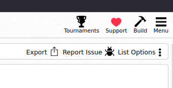
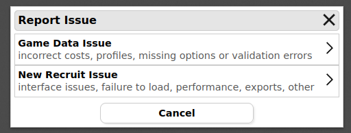

# Warhammer Armies Project - v9.2.3 (Unofficial Battlescribe & New Recruit Files)

## Overview

This repository contains **Battlescribe-compatible data files** for the [New Recruit roster editor](https://www.newrecruit.eu/app/MySystems), based on version **9.2.3** of the **Warhammer Armies Project** (WAP).

These files are **unofficial** and maintained by the community to help players use the latest army book updates in digital list-building tools.

---

## Development Status

The files are currently **under active development**. I typically update one army every 2–3 weeks. Updates are done army by army and may temporarily exclude special characters in early passes.

---

## How to Use

### New Recruit

1. Open the [New Recruit roster editor](https://www.newrecruit.eu/app/MySystems) — no account required.
2. Scroll to the bottom and click **“Add more games.”**
3. Select **“Add from GitHub.”**
4. For **Version**, choose `custom`, and enter: `main`
5. For **Repository**, enter: `sbh427/wap-2.3`
6. Click the green `+` and wait for the upload to finish.
7. You can now start building your list!

### Battlescribe

1. Download and open [Battlescribe](https://www.battlescribe.net/).
2. Go to **Manage Data > Add Data Index URL**
3. Enter: `https://wap-fr.ovh/bsdata/repos.json`
4. Add the repository.
5. Open the tab: **“wap-fr Battlescribe data”**
6. Choose the version (9.2.2 or 9.2.3).
7. Update your data.
8. You can now create rosters using the selected rule version.

> **Note:** Switching rosters between rule versions is not possible, and probably won't be in the future.

---

## Bug Reports

### New Recruit

To report a bug within New Recruit:

1. Click **`Report Issue`** (top right of the page).

   

2. Select **Game Data Issue**.

   

3. Describe the issue (minimum characters required to enable **Send**).

   

### GitHub

Alternatively, you can report bugs by creating an [Issue on GitHub](https://github.com/sbh427/wap-2.3/issues) if you have a GitHub account.

---

## Disclaimer

This is a **fan-made, unofficial project** and is **not affiliated** with Mathias Eliasson, the original WAP team, or the original Battlescribe file maintainers. All credit for the rules belongs to Mathias and the Warhammer Armies Project.

---

## Contributions Welcome

If you'd like to help with updates, corrections, or testing, feel free to open an issue or submit a pull request.

---

**Happy list-building and may your dice roll true!**
