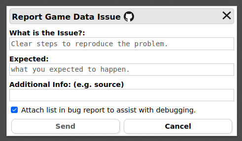

# Warhammer Armies Project – v9.2.3  
### Unofficial BattleScribe & New Recruit data files

---

## Scope & Intent

This project aims to represent **Warhammer Armies Project v9.2.3** rules within list-building tools.  
It does **not** introduce balance changes, house rules, or alternate interpretations beyond what is required for correct implementation.

---

## Project Status

The data files are largely complete, with all armies implemented and playable.  

Ongoing work focuses on:
- Bug fixes and minor corrections  
- Clarifications based on errata or edge cases  

Occasionally, **larger updates** may occur to improve rule representation, resolve rare interactions, or clean up the data structure.  
No regular army rewrites are planned; updates are driven by issues, errata, and community feedback.

---

## Bug Reports & Feedback

Feedback from actual list builders is invaluable. You can report issues through:

### New Recruit
1. Click **`Report Issue`** (top right).  
   
2. Select **Game Data Issue**.  
   
3. Describe the issue (minimum character count required).  
   

Include:
- Army and unit name  
- Rule, option, or interaction in question  
- Expected vs. actual behavior  
- Screenshot or example list, if relevant  

Reports via New Recruit are reviewed alongside GitHub issues.

### GitHub
Submit more complex issues or discussions via [GitHub Issues](https://github.com/sbh427/wap-2.3/issues).

---

## Contributions

This is a community-driven project, and contributions of all sizes are welcome.  

Areas where help is appreciated:
- Bug fixes and rules corrections  
- Rule implementation improvements  
- Usability and readability improvements  
- Playtesting and validation  

You don’t need to be a rules or data expert — clear feedback, screenshots, or examples are highly valuable.

---

## Known Limitations

- **Some rules are simplified.** Conditional or situational rules may be represented in a simplified way for technical reasons.  
- **Validation is not complete.** The builder enforces many restrictions, but players remain responsible for legal armies and correct gameplay.  
- **Edge cases exist.** Rare combinations and interactions may appear; reports help us improve accuracy.  

---

## FAQ

**Is this an official release?**  
No. These files are unofficial and community-maintained.  

**Does this project change balance, points, or rules?**  
No. Only changes needed to correctly implement or clarify rules are made.  

**Why doesn’t the builder enforce every rule?**  
Some rules depend on game context or interactions that cannot be fully enforced at list-building time.  

**I found something that looks wrong — is it a bug?**  
Report it if a rule is implemented incorrectly, points/options/restrictions are wrong, or illegal configurations are allowed.  
It may not be a bug if the behavior is situational, legal but unintuitive, or technically unavoidable.  

**Why was my issue closed as “working as intended”?**  
This usually means the implementation matches the rules, the behavior is a tool limitation, or the issue is known. Your report still helps improve clarity and documentation.  

**Why not rewrite a whole army?**  
The focus is on accuracy and stability. Large rewrites are only done for clear rule or technical reasons.  

**Can I suggest improvements?**  
Yes! Feedback on clarity, usability, or readability is always welcome.  

**Do I need to know BattleScribe or New Recruit data formats?**  
No. Descriptions, screenshots, examples, or play experience are often more valuable than technical changes.

---

## Disclaimer

This is a fan-made, unofficial project and is **not affiliated** with Mathias Eliasson, the original WAP team, or the original BattleScribe file maintainers.  
All credit for the rules belongs to Mathias Eliasson and the Warhammer Armies Project.

---